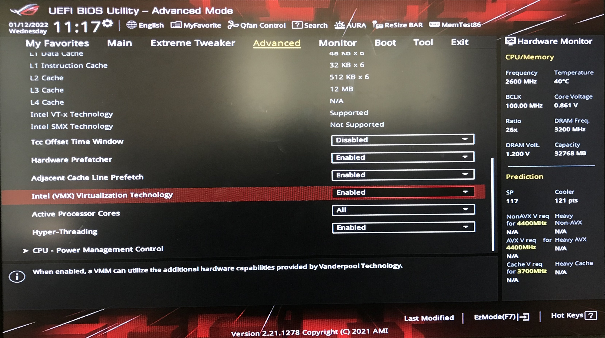
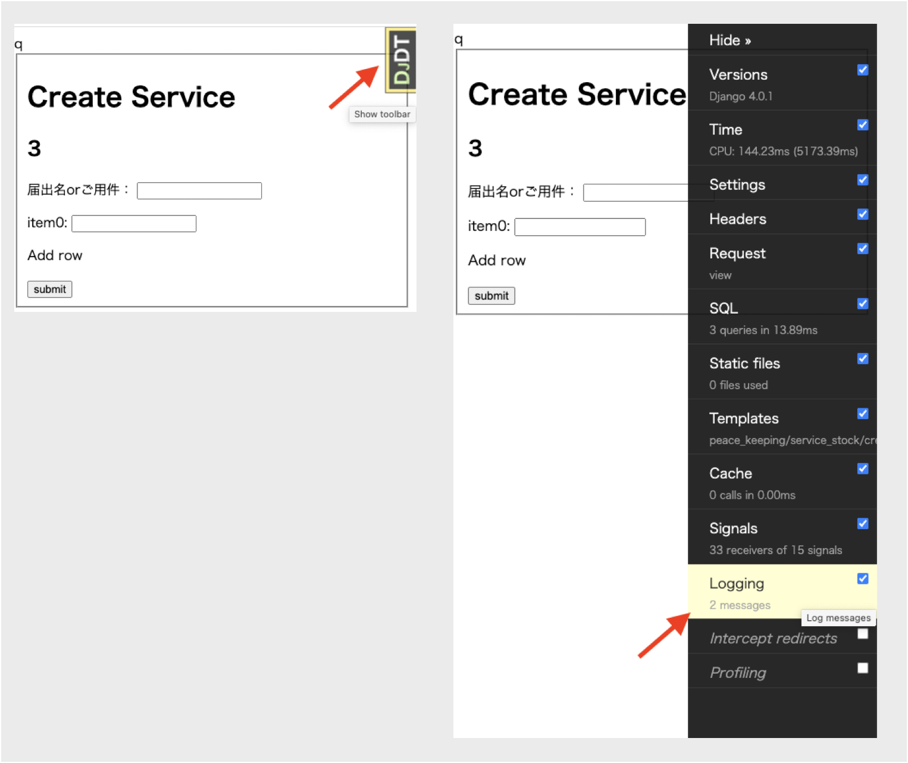

# Docker for Service ID


## Version

荒川Mac：*Docker Desktop 4.3.2 (72729)* 


## Quick Start

### Download Docker

https://www.docker.com/get-started


### Only for Windows

Windows10ユーザーは最初に以下を実行のこと。

1. powershellを**管理者として**起動して以下を実行。

```powershell
wsl --install
```


2. Ubuntuをインストール
```powershell
wsl --install -d Ubuntu-20.04
wsl --set-default-version 2
```

   

3. ~~設定 > `有効化`で検索して`Windowsの機能の有効化または無効化`を確認。~~この手続不要かも。
   - ~~Hyper-V ：チェックon~~
   - ~~Linux用Windows サブシステム（表記違う可能性あり）：チェックon~~
   - ~~仮想マシンプラットフォーム：チェックon~~
   
4. Dockerを起動する。
   - 成功する場合は`For Mac & Windows`へ。
   - 起動が失敗する場合は次を実行。
     
5. BIOSの設定を変更。
   1. `再起動 -> [DELETE]key長押し`(メーカーによってキーが`F2` `F12`など異なる)で以下のような画面に入る。
   2. `CPUの設定項目` > `Intel Virtualization Technology`の項目を探して有効化する。**メーカーによって表現が違うので注意。**以下は参考。




### For Mac & Windows

Mac : 最初からここからスタート。

Windows : `Only for Windows`を完了後、以下を実行。

**コマンドが使えない場合は、書いてある説明を手動で実行すること。**


1. 自分のローカルの作業用ディレクトリに`service-id-on-docker`をクローン & ディレクトリに入る。

```bash
git clone https://gitlab.com/ecbatana-tsukuba/service_id/service-id-on-docker.git
cd service-id-on-docker
```


2. PCが`M1 Mac`ではない場合、以下のコマンドを実行。(`docker-compose.yml`の5行目`platform: linux/x86_64`を削除)
```bash
sed -i.bak -e '5d' docker-compose.yml
```

   

3. 以下のコマンドで、Service IDのプロジェクトをDockerプロジェクト内にクローン。ディレクトリ名を`Service_ID`に変更。

```bash
git clone https://gitlab.com/ecbatana-tsukuba/service_id/database.git
mv database Service_ID
```

   

4. Dockerを起動後、Dockerのプロジェクトをビルド&起動。

```bash
docker-compose build
docker-compose up
```

設定完了。


## Log

Dockerで動かしているプロジェクトは、コンソールでログを表示できないので、debug_toolbarのタブを開いてログを表示する。




