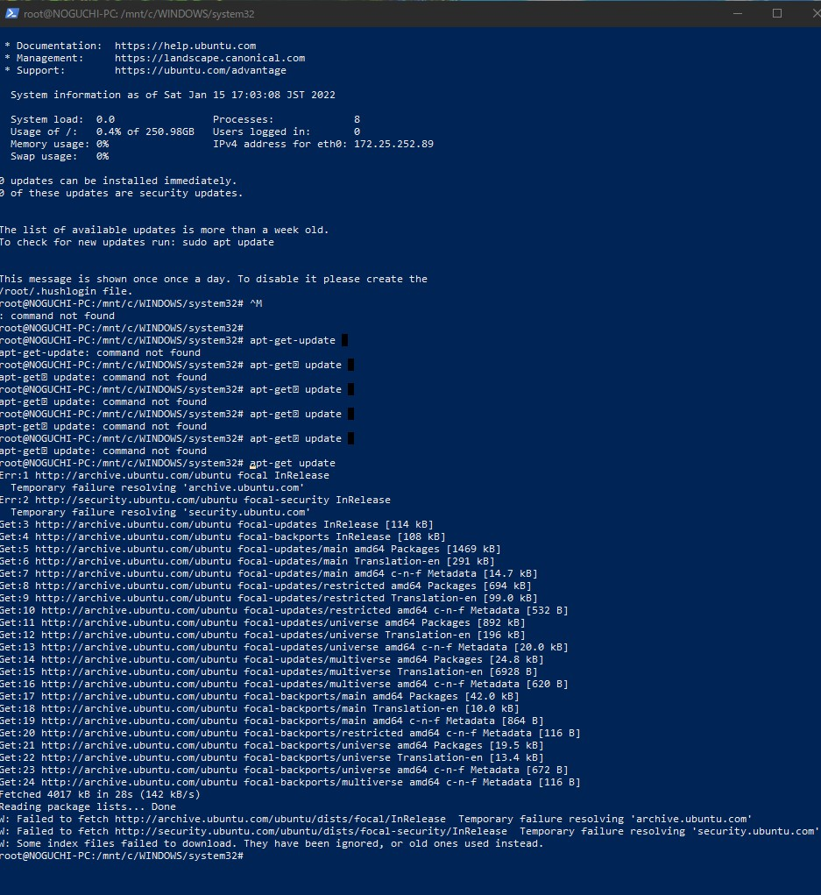

# Install Error Windows

## 松居アドバイス

### 方法は2パターン

1. hyper-vにubuntuいれて、更にその中にdockerいれる
2. wsl有効化コマンドを実行してdocker for desctopいれる。Powershellで `dism.exe /online /enable-feature /featurename:Microsoft-Windows-Subsystem-Linux /all /norestart`


### 織地エラー：

- バージョン下げたら起動できた。
- docker dirのパーミッションがなくてエラー。パーミッション変更して起動成功。


## 野口error

### error

`apt-get update`がエラーで中断される。


### 対策

wsl, ubuntuのアンインストール後、再インストールを試す。その後、`織地error`の手順を実行。

https://ari23.hatenablog.com/entry/wsl2-uninstall

#### wsl

`Windowsの設定` > `アプリと機能` > `Windows Subsystem for Linux Update` からアンインストール


#### Ubuntu 

`Windowsの設定` > `アプリと機能` > `Ubuntu` からアンインストール


### 備考：error状況




## 織地error

### Error

`wsl --install` not work. wsl2がインストールされるのではなくオプション一覧が表示される。


### 対策

[wsl.exe --install not running](https://github.com/MicrosoftDocs/WSL/issues/1054).

 `wsl.exe --install -d Ubuntu`


### error状況

```
Windows PowerShell
Copyright (C) Microsoft Corporation. All rights reserved.

新しいクロスプラットフォームの PowerShell をお試しください https://aka.ms/pscore6

PS C:\WINDOWS\system32> bash
Linux ? Windows ???????????????????????????????????
???????????? Microsoft Store ??????????????????????:
https://aka.ms/wslstore
PS C:\WINDOWS\system32> wsl --install
Copyright (c) Microsoft Corporation. All rights reserved.

使用法: wsl.exe [Argument] [Options...] [CommandLine]

Linux バイナリを実行するための引数:

    コマンドラインを指定しない場合、既定のシェルが起動され wsl.exe ます。

    --exec、-e <CommandLine>
        既定の Linux シェルを使用せずに、指定したコマンドを実行します。

    --
        残りのコマンドラインをそのまま渡します。

オプション：
    --cd <Directory>
        指定したディレクトリを現在の作業ディレクトリとして設定します。
        ~ が使用されている場合は、Linux ユーザーのホームパスが使用されます。パスが始まる場合
        文字が含まれている場合は、Linux の絶対パスと解釈されます。
        それ以外の場合、この値は Windows の絶対パスである必要があります。

--分布、-d <Distro>
        指定したディストリビューションを実行します。

    --ユーザー、-u <UserName>
        指定されたユーザーとして実行します。

Windows Subsystem for Linux を管理するための引数:

    --ヘルプ
        使用方法に関する情報を表示します。

    --install [Options]
      追加の Windows Subsystem for Linux ディストリビューションをインストールします。
      有効なディストリビューションの一覧を表示するには、'wsl--list--online' を使用してください。

        オプション:
            --distribution, -d [Argument]
                名前を指定して配布をダウンロードしてインストールします。

                引数:
                   有効なディストリビューション名 (大文字と小文字は区別されません)。

                例:
                    wsl --install -d Ubuntu
                    wsl --install --distribution Debian

    --set-default-version <Version>
         新しいディストリビューションの既定のインストールバージョンを変更します。

    --shutdown
        直ちに、すべての実行中の配布および WSL 2
 軽快なユーティリティの仮想マシンを終了します。

    --status
        Linux の Windows Subsystem の状態を示します。

    --update [Options]
        オプションが指定されていない場合、WSL 2 カーネルは更新され
 、最新バージョンになります。

        オプション:
            --rollback
                以前のバージョンの WSL 2 カーネルに戻します。

Windows Subsystem for Linuxのディストリビューションを管理するための引数:

    --export <Distro> <FileName>
        ディストリビューションを tar ファイルにエクスポートします。
ファイル名には、標準出力として - を使用できます。

    --import <Distro> <InstallLocation> <FileName> [Options]
        指定した tar ファイルを新しいディストリビューションとしてインポートします。
ファイル名には標準入力として - を使用できます。

        オプション:
            --version <Version>
                新しいディストリビューションに使用するバージョンを指定します。

    --list, -l [Options]
        ディストリビューションの一覧を表示します。

        オプション:
            --all
                現在インストールまたはアンインストールされているディストリビューションを含む、すべてのディストリビューションを表示します。

            --running
                現在実行中のディストリビューションのみを表示します。

            --quiet, -q
                ディストリビューション名のみを表示します。

            --verbose, -v
                すべてのディストリビューションに関する詳細な情報を表示します。

            --online, -o
                'wsl --install' を使用してインストールするために使用できるディストリビューションの一覧を表示します。

    --set-default, -s <Distro>
       ディストリビューションを既定として設定します。

    --set-version <Distro> <Version>
        指定されたディストリビューションのバージョンを変更します。

    --terminate, -t <Distro>
        指定されたディストリビューションを終了します。

    --unregister <Distro>
        ディストリビューションの登録を解除し、ルートファイルシステムを削除します。
PS C:\WINDOWS\system32> wsl --install -d Ubuntu
ダウンロード中: Ubuntu
インストール中: Ubuntu
Ubuntu はインストールされました。
Ubuntu を起動しています...
PS C:\WINDOWS\system32> wsl --set-version Ubuntu-20.04 2
指定された名前のディストリビューションはありません。
PS C:\WINDOWS\system32>
```


## 参考手順

- [手順 4 - Linux カーネル更新プログラム パッケージをダウンロードする](https://docs.microsoft.com/ja-jp/windows/wsl/install-manual#step-4---download-the-linux-kernel-update-package)
- [Windows 10 HomeへのDocker Desktop (ver 3.0.0) インストールが何事もなく簡単にできるようになっていた (2020.12時点)](https://qiita.com/zaki-lknr/items/db99909ba1eb27803456)


