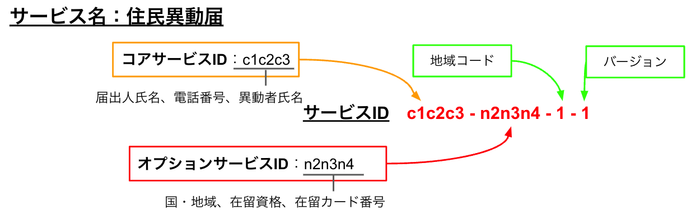

# Service ID


## 目次

1. [用語・概念集](## 用語・概念集)
2. [URLと機能](## URLと機能)
3. [Re-Start Project](## Re-Start Project)
4. [システム内での表記(コーディングルール)](## システム内での表記（コーディングルール）)
5. [アプリ構成](## アプリ構成)
6. [Refferences](##References)


## 新規加入エンジニア用ドキュメント

[READMES](./READMES/)を参照のこと。


## 用語・概念集

用語が示す内容の詳細については、

以下のリンクから最新版の`顧客説明用資料_技術詳細`を確認のこと。(リンク先にアクセスできない場合は松居さんに連絡)

[Google Drive 顧客説明用資料](https://drive.google.com/drive/u/0/folders/1GaQC7nQsyV8LZvHBndl7LPR6p9f-XsoM)


### サービスID基本概念

- 特定のサービス(行政手続き)にはサービスIDとサービス名が割り振られる。
- サービスIDはコアサービスID + オプションサービスID + 地域コード + バージョンからなる。
- サービスIDに含まれるコア項目ID・オプション項目IDから、項目を特定することができる。
- この仕組によって、別名で同種のフォームが無秩序に作られることを防止。




### 用語一覧

以下がよく用いられる用語。インデントは概念の包含関係を示す。

#### サービスID・サービス名

- サービスID・サービス名
  - コアサービスID・コアフォーム
    - コア項目ID・コア項目
  - カスタムフォーム・オプションサービスID
    - オプション項目ID・オプション項目
  - 地域コード
  - バージョン


#### 標準・非標準

- サービス名
  - 標準名
  - 非標準名
- サービス項目
  - 標準項目
    - コア項目
    - オプション項目
  - 非標準項目


#### ワードファミリー

- ワードファミリー・ワード親戚
  - ワード
    - 語頭
    - 接続語
    - 語尾


## URLと機能

| 機能                                                         | URL <u>(ポート番号は自分が利用している番号に変更のこと)</u>  | 備考                                                         |
| ------------------------------------------------------------ | ------------------------------------------------------------ | ------------------------------------------------------------ |
| admin画面                                                    | ローカル：http://127.0.0.1:8000/admin/<br />サーバー：http://13.231.138.231:8001/admin/ | 先に`python3 manage.py createsuperuser`コマンドで自分用のアカウントを作成すること。 |
|                                                              |                                                              |                                                              |
| サービス項目のワードファミリーの生成                         | ローカル：http://127.0.0.1:8000/words/merge_words/serv_item/<br />サーバー：http://13.231.138.231:8001/words/merge_words/serv_item/ | 語頭、接続語、語尾の全組み合わせからワードファミリーを生成。 |
| サービス名のワードファミリーの生成                           | ローカル：http://127.0.0.1:8000/words/merge_words/serv_name/<br />サーバー：http://13.231.138.231:8001/words/merge_words/serv_name/ | 同上                                                         |
|                                                              |                                                              |                                                              |
| ワードファミリーのうちの一つをコア項目として指定             | ローカル：http://127.0.0.1:8000/words/set_is_standard/serv_item/<br />サーバー：http://13.231.138.231:8001/words/set_is_standard/serv_item/ |                                                              |
| ワードファミリーのうちの一つを標準名として指定               | ローカル：http://127.0.0.1:8000/words/set_is_standard/serv_name/<br />サーバー：http://13.231.138.231:8001/words/set_is_standard/serv_name/ |                                                              |
|                                                              |                                                              |                                                              |
| 新しいコアフォームを作る                                     | ローカル：http://127.0.0.1:8000/peace_keeping/create_serv/3/<br />サーバー：http://13.231.138.231:8001/peace_keeping/create_serv/3/ | 末尾の数字は必要なサービス項目用の入力欄の数。               |
| 住民がカスタムフォームに入力するための画面                   | ローカル：[http://127.0.0.1:8000/peace_keeping/get_needs/神奈川県相模原市/](http://127.0.0.1:8000/peace_keeping/get_needs/%E7%A5%9E%E5%A5%88%E5%B7%9D%E7%9C%8C%E7%9B%B8%E6%A8%A1%E5%8E%9F%E5%B8%82/)<br />サーバー：[http://13.231.138.231:8001/peace_keeping/get_needs/神奈川県相模原市/](http://13.231.138.231:8001/peace_keeping/get_needs/%E7%A5%9E%E5%A5%88%E5%B7%9D%E7%9C%8C%E7%9B%B8%E6%A8%A1%E5%8E%9F%E5%B8%82/) | 末尾の地域名は`都道府県+市区町村`。指定した自治体のカスタムフォームが表示される。 |
|                                                              |                                                              |                                                              |
| 指定した自治体の、紙をスキャンしたデータ(CSV)から利用されているサービス項目を取り込む | ローカル：[http://127.0.0.1:8000/restore_order/select_candidates/神奈川県相模原市/](http://127.0.0.1:8000/restore_order/select_candidates/%E7%A5%9E%E5%A5%88%E5%B7%9D%E7%9C%8C%E7%9B%B8%E6%A8%A1%E5%8E%9F%E5%B8%82/)<br />サーバー：[http://13.231.138.231:8001/restore_order/select_candidates/神奈川県相模原市/](http://13.231.138.231:8001/restore_order/select_candidates/%E7%A5%9E%E5%A5%88%E5%B7%9D%E7%9C%8C%E7%9B%B8%E6%A8%A1%E5%8E%9F%E5%B8%82/) | 末尾の地域名は`都道府県+市区町村`。読み込み対象は地域名がファイル名のCSVファイル。 |
| 指定した自治体の、紙をスキャンしたデータ(CSV)から入力内容を取り込む | ローカル：[http://127.0.0.1:8000/restore_order/ready_to_load_papers/神奈川県相模原市/](http://127.0.0.1:8000/restore_order/ready_to_load_papers/%E7%A5%9E%E5%A5%88%E5%B7%9D%E7%9C%8C%E7%9B%B8%E6%A8%A1%E5%8E%9F%E5%B8%82/)<br />サーバー：[http://13.231.138.231:8001/restore_order/ready_to_load_papers/神奈川県相模原市/](http://13.231.138.231:8001/restore_order/ready_to_load_papers/%E7%A5%9E%E5%A5%88%E5%B7%9D%E7%9C%8C%E7%9B%B8%E6%A8%A1%E5%8E%9F%E5%B8%82/) | 同上。                                                       |
|                                                              |                                                              |                                                              |


## Re-Start-Project

DBの削除&再生成は無数に繰り返すことになるものと心得て、以下の手順を実行。


### DBの削除&再生成

```mysql
drop database service_id;
create database service_id;
use service_id;
```


### DBを再生成したあとのmigrateの実行順序

1. settings.pyにて以下の箇所をコメントアウト

   ```python
   INSTALLED_APPS = [
       'django.contrib.admin', # here
   
       ...
       
   AUTH_USER_MODEL = 'offices.Officer' # here
   ```

2. root/urls.pyにて以下をコメントアウト

   ```python
   urlpatterns = [
       path('admin/', admin.site.urls), #here
   ```

3. offices/models/officer.pyにて以下を変更
   変更前

   ```python
   class Officer(AbstractUser): # here
       ...
       def __str__(self):
           return self.username #here
   ```

   変更後

   ```python
   class Officer(models.Model): # here
       ...
       def __str__(self):
           return self.USERNAME_FIELD # here
   ```

4. 各app/migrations内を**完全に空**の状態にする。**`__pycache__`, `__init__.py`も削除。**

5. この状態で以下を実行

   ```bash
   python3 manage.py migrate
   python3 manage.py makemigrations words
   python3 manage.py makemigrations offices
   python3 manage.py makemigrations peace_keeping
   python3 manage.py makemigrations restore_order
   python3 manage.py sqlmigrate words 0001
   python3 manage.py sqlmigrate offices 0001
   python3 manage.py sqlmigrate peace_keeping 0001
   python3 manage.py sqlmigrate restore_order 0001
   python3 manage.py migrate
   ```

   

6. 実行語、先程のコメントアウトを元に戻して、以下を実行

   ```bash
   python3 manage.py migrate
   python3 manage.py makemigrations offices
   python3 manage.py sqlmigrate offices 0002
   python3 manage.py migrate
   ```


6. シーディングで空のDBにデータを入れる。


   - ==注1：テーブルの構造が変わっている場合はjsonファイル内のカラム名変更等すること。==

   ```bash
   python3 manage.py loaddata words/seed/0006_word_full.json
   python3 manage.py loaddata offices/seed/0006_office.json
   python3 manage.py loaddata peace_keeping/seed/0006_peace_keeping.json
   python3 manage.py loaddata restore_order/seed/0006_restore_order.json
   ```

   


## システム内での表記(コーディングルール)

モデル設計時のクラス名・変数名、テンプレートと値をやり取りする際のキー名・nameプロパティ名、に利用のこと。

| 資料内での表記         | 英語表記              | システム内における略表記 | 備考                                                         |
| ---------------------- | --------------------- | ------------------------ | ------------------------------------------------------------ |
| 混乱の平定             | Restore Order         | restore_order            |                                                              |
| 秩序の維持             | Peace Keeping         | peace_keeping            |                                                              |
| 適用条件               | Applicable Conditions | app_con                  |                                                              |
|                        |                       |                          |                                                              |
| サービスID             | Service ID            | serv_id                  |                                                              |
| サービス名(**名前**)   | Service Name          | serv_name                |                                                              |
| サービス項目(**項目**) | Service Item          | serv_item                | core_item、opt_item、n_std_itemの総称                        |
|                        |                       |                          |                                                              |
| コアサービスID         | Core Service ID       | core_serv_id             |                                                              |
| コアフォーム           | Core Form             | core_form                |                                                              |
| コア項目ID             | Core Item ID          | core_item_id             |                                                              |
| コア項目               | Core Item             | core_item                |                                                              |
|                        |                       |                          |                                                              |
| オプションサービスID   | Option Service ID     | opt_serv_id              |                                                              |
| カスタムフォーム       | Custom Form           | custom_form              |                                                              |
| オプション項目ID       | Option Item ID        | opt_item_id              |                                                              |
| オプション項目         | Option Item           | opt_item                 |                                                              |
|                        |                       |                          |                                                              |
| 地域コード             | Area Code             | area_code                |                                                              |
| バージョン             | Version               | ver                      |                                                              |
| 標準                   | Standard              | std                      | サービス内で実際に利用されるサービス名・サービス項目は標準   |
| 非標準                 | Non-Standard          | n_std                    | 非標準は「類似しているが利用されない」の意                   |
| 非標準名               | Non-Standard Name     | n_std_name               | 同上                                                         |
| 非標準項目             | Non-Standard Item     | n_std_item               | 同上                                                         |
|                        |                       |                          |                                                              |
| ワードファミリー       | Word Family           | word_family              | ex. 1                                                        |
| ワード親戚             | Word Relative         | word_relative            | word_familyと近い意味合いのfamily同士をワード親戚としてパイプつなぎする。ex. 1\|2\|5 |
| ワード                 | Word                  | word                     |                                                              |
| 語頭                   | Start                 | name_start, item_start   |                                                              |
| 接続語                 | Joint                 | joint                    |                                                              |
| 語尾                   | End                   | name_end, item_end       |                                                              |
|                        |                       |                          |                                                              |
| 表現                   | Phrase                | phrase                   | DB内にて各レコードの日本語表現を保存するカラム名。旧来はnameとitemが混在。 |
| 紙                     | Paper                 | paper                    | 各自治体が持っている提出された紙の束                         |
| マイナンバー           | my number             | my_num                   |                                                              |
| マイナンバーID         | my number id          | my_num_id                |                                                              |
| ナンバー               | number                | num                      |                                                              |
| 在留番号               | Resident Number       | resident_num             |                                                              |


## アプリ構成

- peace_keeping
  - 役割：サービスのストック、入力された内容の保存
  - モデル
    - Service_Stock : 全国自治体で作成された全サービスの保管場所
    - Used_Service : 住民が利用したサービスと入力した内容の保管場所
- restore_order
  - 役割：OCRから取得してあるデータの、サービス名&項目の整理、統合、記入内容の保存。
  - モデル
    - Raw_Item : **紙から吸い出した項目**とそれに対応するサービス名・サービス項目の対応を保存。
    - Archived_Data : **紙から吸い出した記入内容**を、Raw_Itemに対応させながら保存。DBとして再利用可能な状態。
- words
  - 役割：サービス名・項目、バリデーション用の非標準名・項目の生成・保存。
  - モデル
    - Joint
    - Item_Start
    - Item_End
    - Name_Start
    - Name_End
    - Service_Name
    - Service_Item
- offices
  - 役割：
  - モデル
    - Officer : 中央政府役人、地方役人のユーザー登録用。
    - Area : 都道府県市町村
    - Resident : 日本に在住している人の氏名、マイナンバーIDなど。
- utils
  - 役割：どのモデルに属すか微妙な機能を一括して担う
  - モデル：なし
  - views
    - Encoder : 
      - サービス項目→サービス項目ID
      - サービス項目ID→コアサービスID・オプション項目IDに変換
    - Decoder : 
      - サービス項目←サービス項目ID
      - サービス項目ID←コアサービスID・オプション項目IDに変換


## References

[全国自治体名リスト(総務省)](https://www.soumu.go.jp/denshijiti/code.html)：これをもとにAreaモデルを作成


