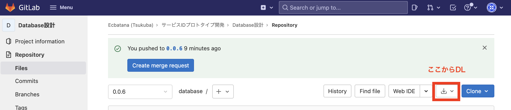

# Start Project


## 開発サーバーで開発する場合

### バージョン情報

- サーバー ubuntu 20.04

- python：3.8.10
- mysql: 8.0.26
- Django : 3.2.9


### セットアップ

1. [ssh key file](https://www.dropbox.com/sh/eh8viz2cju3k7l5/AAAGWCZYHJzuTj5WqeXCgcL6a/key?dl=0&subfolder_nav_tracking=1)をローカルPCの~/.sshに保存。(windowsの場合もこれであってる?)
2. 以下を実行して開発サーバーに入る

```bash
ssh -i ~/.ssh/ecbatana_sharestock.pem ubuntu@13.231.138.231
```

3. プロジェクトディレクトリに入る

```bash
cd service_id
```

4. Djangoを起動

```bash
python3 manage.py runserver 0.0.0.0:8000
```

5. ローカルPCのブラウザから[利用できるURL](https://gitlab.com/ecbatana-tsukuba/service_id/database#url%E3%81%A8%E6%A9%9F%E8%83%BD)にアクセスする。URLにアクセスする際、`http://127.0.0.1:8000/`の部分を`http://13.231.138.231:8000/`に変更すること。


### createsuperuser

12/30 11:30現在、createsuperuserに失敗するので、以下のID/PSWDでadminにログインするようにしてください。

- ID : b.a520y@gmail.com
- PSWD : service_id


### 開発ディレクトリ割当

#### 荻野

- ディレクトリ：`~/service_id_0001`
- runserverする`ip:port` : `python3 manage.py runserver 0.0.0.0:8001` 


#### 加藤

- ディレクトリ：`~/service_id_0002`
- runserverする`ip:port` : `python3 manage.py runserver 0.0.0.0:8002`


### Link

- [ssh key file](https://www.dropbox.com/sh/eh8viz2cju3k7l5/AAAGWCZYHJzuTj5WqeXCgcL6a/key?dl=0&subfolder_nav_tracking=1)
- [サーバー情報](https://task.cafelatte.jp/projects/sabisuidpurototaipuzuo-cheng/wiki/wiki)


## 自分のローカル環境で開発する場合

### プロジェクトをDLする

https://gitlab.com/ecbatana-tsukuba/service_id/database/-/tree/0.0.6




### 開発環境のセットアップ

#### 共通

1. ターミナルでプロジェクトディレクトリに移動

```bash
cd ~/some_dir/project_dir
```

2. ターミナルから以下を実行し、Mysqlをスタート&ログイン

```bash
sudo mysql.server start
sudo mysql -u root
```

3. ログイン後、mysql内で以下を実行しDBを生成。

```mysql
create database service_id;
use service_id;
```

4. もう一つターミナルを起動し、プロジェクトのルートディレクトリから(**mysqlからではなく**)以下を実行してDBのバックアップからテーブルとレコードを構築。

```bash
cd ~/some_dir/project_dir
mysql -u root service_id < files/sqls/service_id_full.sql
```

5. Djangoパッケージのインストール

```
pip install django-seed
pip install django-boost
pip install mysqlclient
pip install django-import_export
pip install django-cors-headers
```


#### パッケージの導入(必要に応じて) 

##### mysqlの導入

###### Mac

```
brew install mysql mysql-client
```

→PIDファイルが存在しない場合の対応：https://qiita.com/jonakp/items/477a18d4a94c01a31583


###### Windows

Windowsユーザーの新規メンバーがここの処理を作成


これでセットアップ完了

